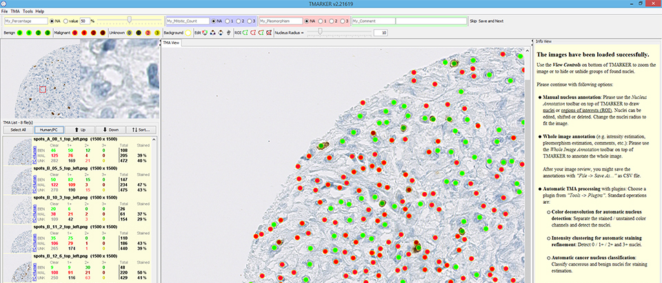

TMARKER assists in cell nuclei counting and staining estimation of pathological immunohistochemical TMA images and non-TMA images.

Two main scenarios are addressed with TMARKER:

- You want to know how many cell nuclei on the image are positive and negative for a certain protein. Therefore, you already did an immunohistochemical staining experiment. TMARKER provides reproducible, stable and accurate cell counting and staining estimation assistance with color deconvolution.
- For staining estimation, you only want to consider one type of cells in the image (for example, only relevant cancer cells). TMARKER provides modern machine learning algorithms that detect these relevant cells in the image and perform staining estimation only on these cells. This procedure is also reproducible, stable and transferable.

Download the OS-agnostic Java distribution [here](https://schuefflerlab.org/software/tmarker/tmarkerv2.146.zip).

Academic partners:

- [ETH Zurich, Switzerland](https://www.ethz.ch/)
- [NEXUS Personalized Health Technologies, Switzerland](https://www.nexus.ethz.ch/)
- [University Hospital Zurich, Switzerland](https://www.usz.ch/)
- [Thomas Fuchs Lab, New York, USA](http://thomasfuchslab.org/)

Please cite TMARKER as you use it:

Peter J. Schüffler, Thomas J. Fuchs, Cheng S. Ong, Peter Wild and Joachim M. Buhmann. TMARKER: A Free Software Toolkit for Histopathological Cell Counting and Staining Estimation. Journal of Pathology Informatics, vol. 4, 2, p. 2, 2013. doi: [10.4103/2153-3539.109804](https://doi.org/10.4103/2153-3539.109804)